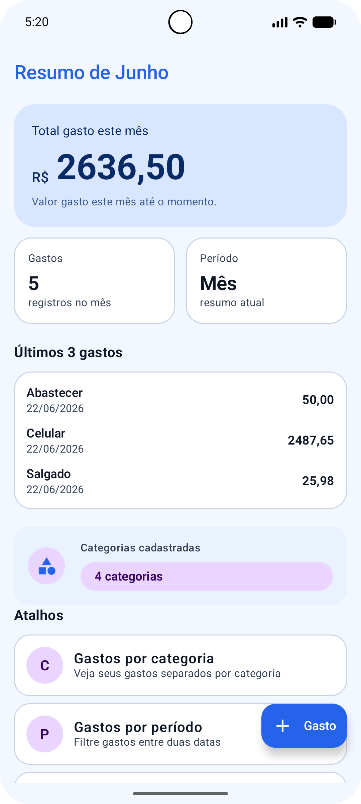
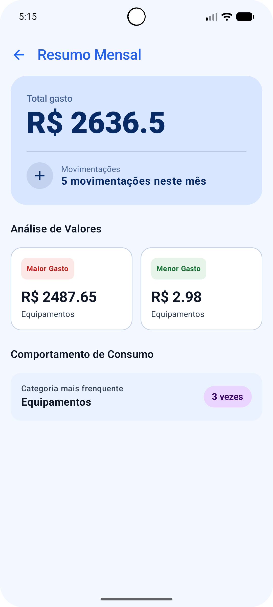
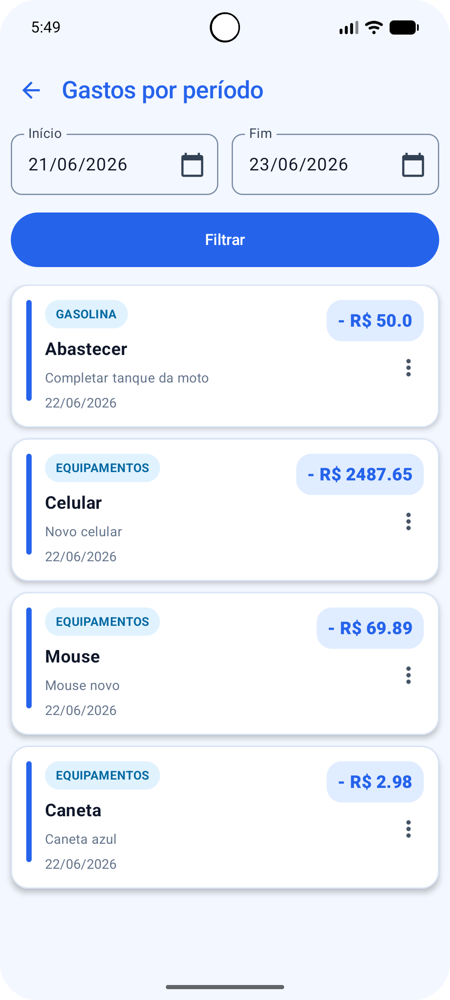

# Meus Gastos

Aplicativo Android nativo para controle simples de gastos pessoais, desenvolvido com **Kotlin**, **Jetpack Compose**, **Room**, **Hilt** e arquitetura baseada em **Clean Architecture + MVVM**.

O objetivo do app é permitir que o usuário registre gastos do dia a dia de forma rápida, organize esses gastos por categoria e acompanhe um resumo financeiro simples por período.

---


## 🖼️ Telas Principais

|       Tela de Listagem        |                Resumo do Mês                 |                    Gasto por período                    |
|:-----------------------------:|:--------------------------------------------:|:-------------------------------------------------------:|
|  |  |  |

---


## Sobre o projeto

O **Meus Gastos** foi criado com foco em simplicidade. A ideia não é ser um sistema financeiro complexo, com investimentos, cartões, contas bancárias ou múltiplas fontes de renda.  
O foco principal é responder perguntas simples como:

- Quanto eu gastei?
- Em que categorias estou gastando mais?
- Quais foram meus últimos gastos?
- Como estão meus gastos no mês?

Esse projeto também faz parte do meu portfólio como desenvolvedor Android, aplicando boas práticas de organização, separação de responsabilidades e persistência local.

---

## Funcionalidades

- Cadastro de gastos
- Edição de gastos
- Exclusão de gastos
- Listagem de gastos
- Cadastro de categorias
- Edição de categorias
- Exclusão de categorias
- Listagem de categorias
- Filtro de gastos por categoria
- Resumo dos gastos do mês
- Exibição dos últimos gastos cadastrados
- Seleção de data do gasto
- Interface desenvolvida com Jetpack Compose
- Persistência local com Room

---

## Tecnologias utilizadas

- **Kotlin**
- **Jetpack Compose**
- **Material 3**
- **Room Database**
- **Hilt**
- **Coroutines**
- **Flow**
- **Navigation Compose**
- **Clean Architecture**
- **MVVM**

---

## Arquitetura

O projeto foi organizado seguindo uma separação por features, mantendo as responsabilidades bem divididas entre camadas.

A estrutura geral segue a ideia:

```text
features
 ├── gasto
 │   ├── data
 │   ├── domain
 │   └── presentation
 │
 ├── categoria
 │   ├── data
 │   ├── domain
 │   └── presentation
 │
 └── home
     └── components
```

### Camada `data`

Responsável pela comunicação com a base local e implementação dos repositórios.

Exemplos:

- Models locais
- DAOs
- Mappers
- Implementações dos repositories

### Camada `domain`

Responsável pelas regras de negócio da aplicação.

Exemplos:

- Entities
- Interfaces de repositories
- Use cases

### Camada `presentation`

Responsável pela interface e controle de estado das telas.

Exemplos:

- Screens
- Components
- ViewModels
- UiState
- Estados de formulário

---

## Principais entidades

### Gasto

Representa um gasto registrado pelo usuário.

Campos principais:

- `id`
- `descricao`
- `valor`
- `categoriaId`
- `data`
- `observacao`
- `criadoEm`
- `editadoEm`

### Categoria

Representa uma categoria usada para classificar os gastos.

Campos principais:

- `id`
- `nome`
- `criadoEm`
- `editadoEm`

---

## Telas do app

O app possui telas voltadas para o uso rápido e direto:

- Tela inicial com resumo dos gastos
- Tela de listagem de gastos
- Tela de cadastro e edição de gasto
- Tela de listagem de categorias
- Tela de cadastro e edição de categoria
- Tela de gastos por categoria

---

## Banco de dados local

O app utiliza **Room** para persistência local dos dados.

A escolha pelo Room permite que o aplicativo funcione offline, mantendo os gastos salvos diretamente no dispositivo do usuário.

---

## Organização do estado

O projeto utiliza `ViewModel`, `StateFlow` e estados próprios para controlar a interface.

Exemplo de estado usado no projeto:

```kotlin
sealed class UiState<out T> {
    data object Loading : UiState<Nothing>()
    data class Success<T>(val data: T) : UiState<T>()
    data class Error(val message: String) : UiState<Nothing>()
}
```

Essa abordagem facilita o controle de carregamento, sucesso e erro nas telas.

---

## Objetivo do projeto

Este app foi desenvolvido com o objetivo de praticar e demonstrar conhecimentos em desenvolvimento Android moderno, incluindo:

- Criação de interfaces com Jetpack Compose
- Organização em Clean Architecture
- Uso de Room para persistência local
- Injeção de dependência com Hilt
- Gerenciamento de estado com ViewModel e Flow
- Separação de responsabilidades por camada
- Criação de componentes reutilizáveis

---

## Possíveis melhorias futuras

- Filtro por período
- Gráficos de gastos por categoria
- Busca por descrição
- Ordenação por data ou valor
- Exportação dos gastos
- Backup em nuvem
- Sincronização com Firebase
- Definição de orçamento mensal
- Notificações de limite de gastos
- Melhorias visuais na tela inicial

---

## Status do projeto

Projeto em desenvolvimento, com a primeira versão funcional próxima da finalização.

---

## Autor

Desenvolvido por **Valdomiro Santos**.

---

## Licença

Este projeto está disponível apenas para fins de estudo e portfólio.
